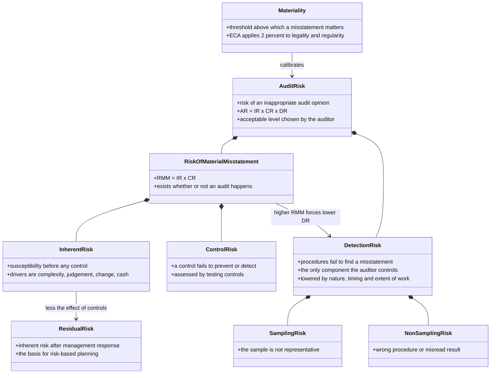
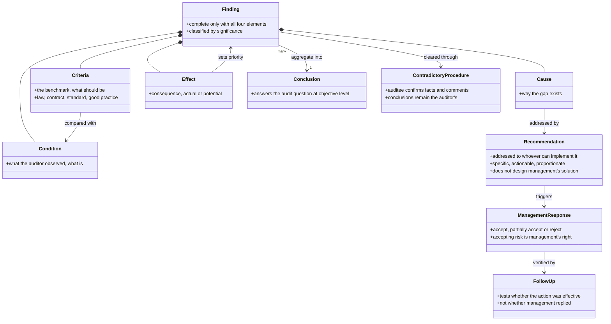
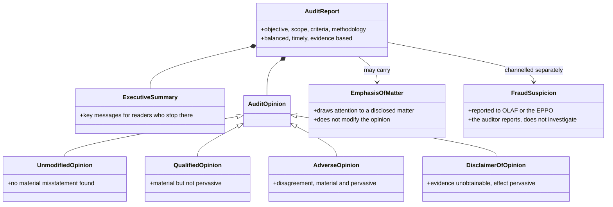
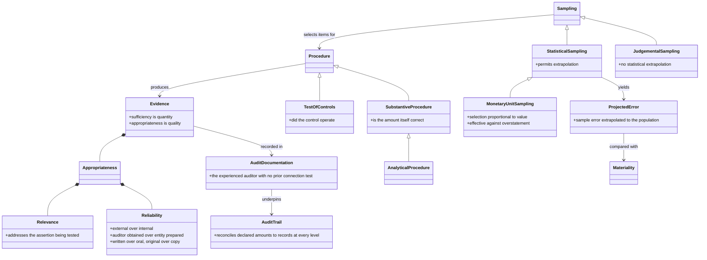
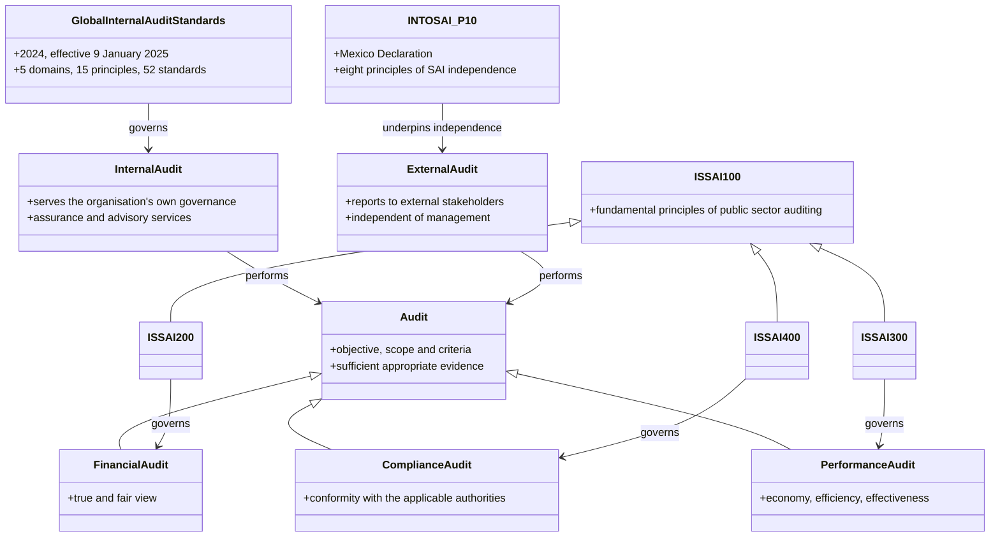
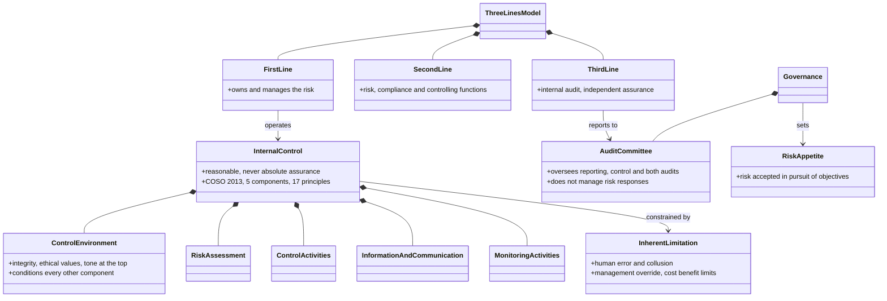
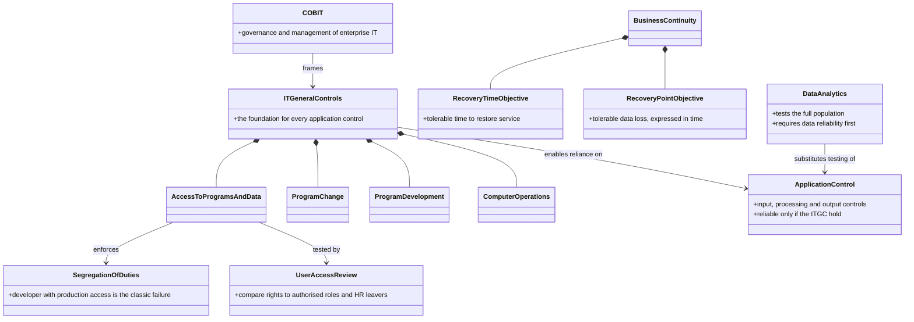
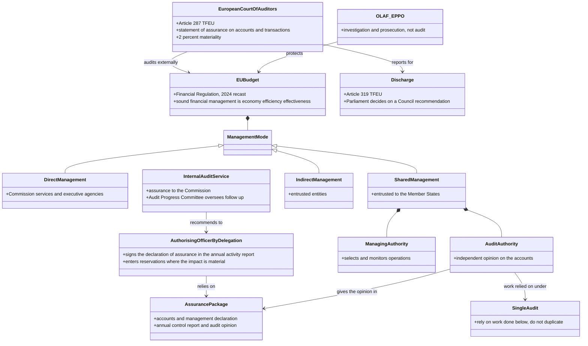
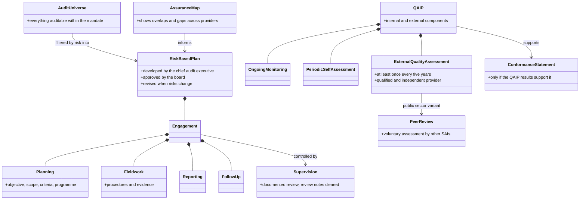

# EPSO/AD/428/26

## Audit concepts and how they connect

Most MCQ distractors are not wrong facts, they are wrong _relationships_: the risk the auditor does not control, the element a finding is missing, the standard that governs the wrong audit type. Read the arrows, not just the boxes.


**Reading the notation**

Composition (filled diamond) means _is made of_. Inheritance (hollow triangle) means _is a kind of_. A plain arrow means _acts on_. Half the content is in the arrow types.


### 1. The audit risk model

_Duty cluster: Risk-based audit work_

Audit risk decomposes once, into the risk that a misstatement exists and the risk that the audit fails to catch it. The first belongs to the entity and the auditor can only assess it; the second belongs to the auditor and is the only dial available.


**Where the MCQ bites**

* **Inherent before controls, residual after.** Residual risk is a management and planning concept; control risk is an audit assessment. They are not synonyms.
* **Only detection risk is the auditor's.** A question asking what the auditor does when control risk rises is answered by more substantive work, never by raising materiality or re-assessing inherent risk.
* **Sampling risk is a part of detection risk**, not a separate fourth term in the model.


### 2. Anatomy of a finding

_Duty cluster: Conclusions and recommendations_

A finding is a four-part structure, and each part does a distinct job downstream: criteria make the gap arguable, effect sets the priority, cause determines what the recommendation must address. Drop one element and the finding is only an observation.


**Where the MCQ bites**

* **Recommendations attach to cause, not condition.** That is the whole point of root cause analysis, and the reason a recommendation that fixes the symptom is marked wrong.
* **Conclusion sits above findings.** It answers the audit question; findings support it.
* **The contradictory procedure validates facts, not conclusions.** Auditee agreement is never a condition of publication.
* **Follow-up tests effect, not response.** A management assertion that action was taken is not evidence that it worked.


### 3. Reports and opinions

_Duty cluster: Audit reporting_

Opinion type is decided by two questions in order: is the problem disagreement or missing evidence, and is it material but contained, or material and pervasive. Emphasis of matter sits outside that grid entirely.


**Where the MCQ bites**

* **Adverse is disagreement, disclaimer is absence of evidence.** Both pervasive; the difference is the reason.
* **Emphasis of matter never modifies the opinion.** An option saying it substitutes for a qualification is always wrong.
* **Balance is not arithmetic.** It means context and the auditee's position, not equal counts of praise and criticism, and never dropping a contested finding.
* **Fraud goes through the channel, fast.** Not investigation, not confrontation, not waiting for proof.


### 4. Evidence and sampling

_Duty cluster: Evidence, data and documentation_

Evidence has two independent qualities and both must hold: more of a poor source never cures inappropriateness. The sampling branch decides one thing above all, whether you may extrapolate to the population.


**Where the MCQ bites**

* **Sufficiency is how much, appropriateness is how good.** Appropriateness splits further into relevance and reliability; sufficiency does not split.
* **A test of controls asks whether the control operated.** Anything testing the amount itself is substantive, however it is dressed up.
* **The sample means nothing until projected** and compared with materiality. Extending a sample until errors vanish is bias.
* **Full-population analytics removes sampling risk on the exceptions found**, not the need to corroborate them, and never proves intent.


### 5. What kind of audit, under what standard

_Duty cluster: Audit types and standards_

Two taxonomies are in play and candidates conflate them. Financial, compliance and performance are _kinds of audit_. Internal and external are _functions_ defined by whom they serve. Either function can perform any kind.


**Where the MCQ bites**

* **ISSAI 100 / 200 / 300 / 400** — fundamental, financial, performance, compliance. Free marks if memorised.
* **Lima versus Mexico.** INTOSAI-P 1 states the broad precepts; INTOSAI-P 10 sets the eight independence principles.
* **Internal audit is defined by who it serves**, not by what it examines. An internal audit function can and does run performance audits.
* **The 2024 Standards replaced the IPPF.** An option citing the old _International Standards for the Professional Practice of Internal Auditing_ numbering may be the planted distractor.


### 6. Internal control and governance

_Duty cluster: Assessment of audited bodies_

Internal control is what the entity builds; the three lines describe who does what with it; governance oversees the whole arrangement. The auditor is in the third line and therefore inside the picture, not above it.


**Where the MCQ bites**

* **Reasonable, not absolute.** The reason is inherent limitation, not weak audit work or incomplete documentation.
* **Second line supports and monitors; it does not own the risk.** The first line does.
* **The audit committee oversees.** It does not manage responses, approve financial statements on the board's behalf, or run investigations.
* **Economy, efficiency, effectiveness** — cost of inputs, output per input, objectives achieved. Expect a worked example rather than a definition.


### 7. General and application controls

_Duty cluster: IT system audits_

One dependency governs this whole area: application controls are only as trustworthy as the general controls beneath them. Everything else follows from that reliance chain.


**Where the MCQ bites**

* **Weak ITGC means application controls cannot be relied on**, however well designed they are.
* **RPO is data loss, RTO is downtime.** Both in units of time, which is what makes the pair confusable.
* **COBIT governs, ISO 27001 certifies.** Different instruments, routinely swapped in distractors.
* **Access appropriateness is tested against current authorised roles**, not against the approval form filed when the system went live.


### 8. Who audits the EU budget

_Duty cluster: EU institutional framework_

The distinctions that carry marks here are external versus internal versus investigative, and which management mode puts which body in the chain. The Court audits and reports; Parliament discharges; OLAF and the EPPO investigate and prosecute, and are not auditors.


**Where the MCQ bites**

* **Article 287 is the Court's mandate, Article 319 is discharge.** The Court does not grant discharge; Parliament does, on a Council recommendation.
* **The 2 percent recurs in three roles** — Court materiality, the residual error ceiling for cohesion accounts, and the trigger for further corrections. Read which one is being asked.
* **Shared management means Member States implement**; indirect means entrusted entities. Direct is the Commission itself.
* **Single audit avoids duplication; it does not limit who may audit.**
* **The Financial Regulation in force is the 2024 recast.** References to the 2018 regulation are superseded.


### 9. The engagement lifecycle

_Duty cluster: Planning, supervision and quality_

The universe narrows to a plan by risk, the plan resolves into engagements, and a quality programme sits across all of it. Note who owns each step: the chief audit executive develops the plan, the board approves it, management implements recommendations.


**Where the MCQ bites**

* **The CAE develops, the board approves.** Management never owns the plan, and the external auditor never approves it.
* **External quality assessment at least every five years**, by a provider independent and free of conflicts.
* **Conformance cannot be claimed from a charter or from certifications** — only from QAIP results.
* **Hot review precedes issuance and can still change the report; cold review looks back.**
* **An uncovered high risk is reported, not hidden.** Any option that lowers a risk score for presentational reasons is wrong.


### 10. The pairs that generate distractors

_Duty cluster: Cross-cutting_

When a question offers two options that both sound right, it is usually one of these pairs. The distractor is the other half.

| Pair                                 | The distinction the question turns on                                                |
| ------------------------------------ | ------------------------------------------------------------------------------------ |
| Inherent / residual                  | Before controls / after management's response                                        |
| Control risk / detection risk        | The entity's failure / the audit's failure — only the second is the auditor's to set |
| Sufficiency / appropriateness        | Quantity / quality, and quality splits into relevance and reliability                |
| Test of controls / substantive       | Did the control operate / is the amount correct                                      |
| Statistical / judgemental sampling   | Extrapolation permitted / conclusions confined to items examined                     |
| Finding / conclusion                 | A supported building block / the answer to the audit question                        |
| Cause / condition                    | What the recommendation targets / what the auditor observed                          |
| Qualified / adverse / disclaimer     | Material contained / material pervasive disagreement / evidence unobtainable         |
| Emphasis of matter / qualification   | Opinion unmodified / opinion modified                                                |
| Economy / efficiency / effectiveness | Input cost / output per input / objectives achieved                                  |
| ITGC / application control           | Foundation / the control relying on that foundation                                  |
| RTO / RPO                            | Downtime tolerated / data loss tolerated                                             |
| Hot / cold review                    | Before issuance, can still change it / after issuance, informs the next one          |
| Internal / external audit            | Serves its own governance / reports to outside stakeholders                          |
| Audit / investigation                | Assurance against criteria / OLAF and the EPPO establishing wrongdoing               |
| Shared / indirect management         | Member States implement / entrusted entities implement                               |


Companion material: the 100-item MCQ bank and the drill app cover the same eleven clusters. Use this atlas to fix the relationships first — most wrong answers in the bank trace back to one of the arrows above rather than to a missing fact.

