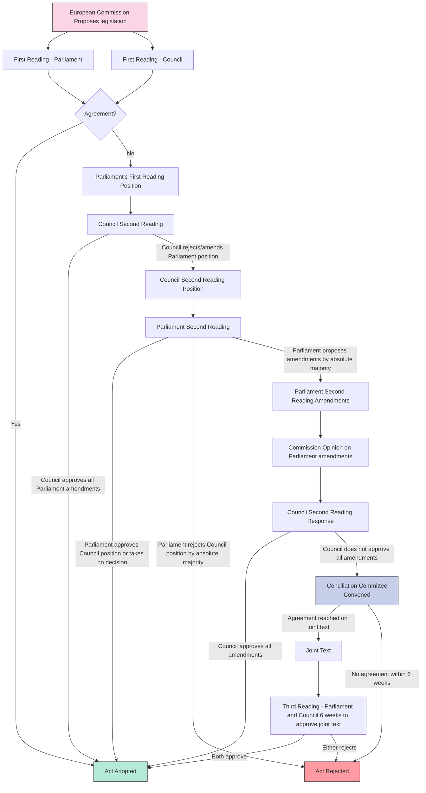

# Ordinary legislative procedure

### Ordinary legislative procedure process

The Ordinary Legislative Procedure (OLP), also known as the co-decision procedure, is the main legislative process in the European Union. It involves the European Parliament and the Council of the European Union in equal measure and aims to ensure that both institutions have a say in the legislative process. Here's a step-by-step description of the OLP:

1. **Proposal by the European Commission:**
   * The legislative process begins when the European Commission proposes new legislation or amendments to existing laws.
   * The Commission is the EU's executive body, and it is responsible for initiating legislation.
2. **First Reading in the European Parliament and Council:**
   * The proposed legislation is simultaneously examined by both the European Parliament and the Council of the European Union.
   * Each institution can propose amendments to the text.
3. **Conciliation Committee (if necessary):**
   * If the Parliament and the Council cannot agree on a common text after the first reading, a Conciliation Committee is formed.
   * The committee consists of an equal number of representatives from the Parliament and the Council.
4. **Second Reading in the European Parliament and Council:**
   * The revised proposal (if any) is then sent back to both the Parliament and the Council for a second reading.
   * They must agree on a common text. If they fail, the legislation is not adopted.
5. **Approval by the European Parliament:**
   * If an agreement is reached, the final text is presented to the European Parliament for approval.
   * The Parliament can either approve or reject the legislation.
6. **Approval by the Council:**
   * If the Parliament approves the legislation, it is then sent to the Council for approval.
   * The Council must also adopt the text for the legislation to become law.
7. **Formal Adoption:**
   * Once both the Parliament and the Council have approved the text, the legislation is formally adopted.
8. **Publication:**
   * The adopted legislation is published in the Official Journal of the European Union.
9. **Implementation by Member States:**
   * Member States are responsible for implementing the legislation into their national laws.

The Ordinary Legislative Procedure ensures that decisions are made jointly by the directly elected representatives in the European Parliament and by representatives of the Member States in the Council, providing a balance of democratic and national interests in the legislative process.

### Ordinary Legislative Procedure milestones

**Treaties:**

* **Maastricht Treaty, November 1993:**
  * Introduction of the codecision procedure with a focus on a limited number of legislative areas, primarily internal market-related.
* **Amsterdam Treaty, May 1999:**
  * Simplification of the codecision procedure, allowing agreements to be concluded at the first reading.
  * Significant expansion of the scope to include over 40 legal bases, encompassing areas such as transport, environment, justice and home affairs, employment, and social affairs.
* **Nice Treaty, February 2003:**
  * Further extension of the codecision procedure's scope to additional areas, broadening its impact.
* **Lisbon Treaty, December 2009:**
  * Codecision officially evolves into the 'ordinary legislative procedure.'
  * Now covers 85 areas of Union action, including critical domains like agriculture, fisheries, and common commercial policy.

**Interinstitutional Agreements:**

* **Joint Declaration on Practical Arrangements for the Codecision Procedure, 2007:**
  * Lays down practical arrangements governing the operation of the codecision procedure.
  * Revised in 2007 to explicitly recognize the significance of the 'trilogue system' throughout the codecision procedure.
* **Framework Agreement on Relations Between the European Parliament and the European Commission, 2010:**
  * Establishes measures to enhance dialogue between the Parliament and Commission.
  * Aims to improve the flow of information and cooperation on procedures and planning.
  * Contains provisions related to Commission meetings with experts, forwarding confidential information to Parliament, negotiating and concluding international agreements, and setting the timetable for the Commission Work Programme.
* **Interinstitutional Agreement on Better Law-Making, 2016:**
  * Came into force in April 2016, replacing the earlier 2003 Agreement.
  * Outlines a series of initiatives and procedures agreed upon by the Parliament, Council, and Commission to pursue better law-making.
  * Addresses programming, better law-making tools (including impact assessments and public and stakeholder consultation), choice of legal basis, delegated and implementing acts, transparency, implementation, and simplification.

